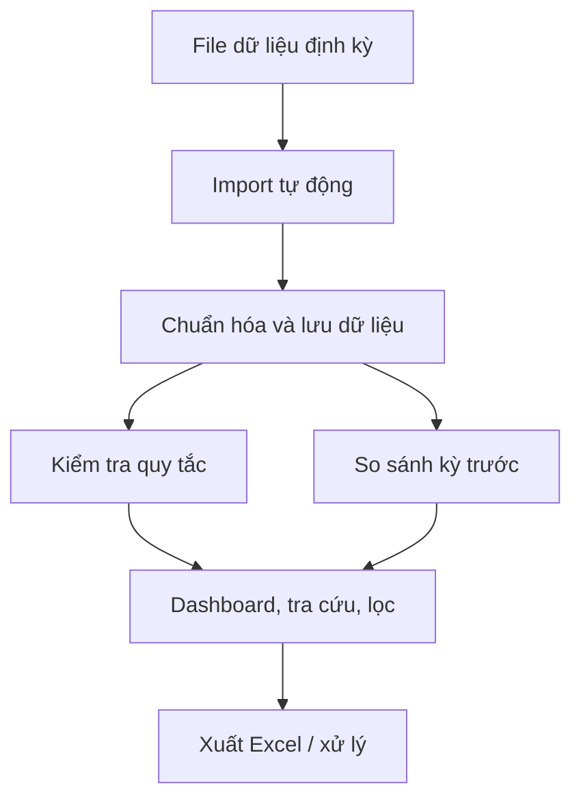
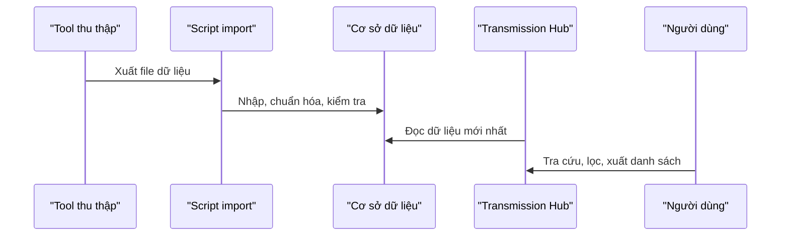

# BÁO CÁO SÁNG KIẾN

## MÔ TẢ SÁNG KIẾN

### Tên sáng kiến

**Transmission Hub - Hệ thống hỗ trợ tra cứu, kiểm tra và quản lý dữ liệu mạng truyền dẫn**

### Lĩnh vực áp dụng

Quản lý, vận hành và tối ưu mạng truyền dẫn/IP; hỗ trợ kiểm tra chất lượng dữ liệu kỹ thuật, phát hiện rủi ro cấu hình, theo dõi trạng thái định tuyến, cảnh báo phần cứng và rà soát tài nguyên có khả năng thu hồi.

### Đơn vị áp dụng

MobiFone Đắk Lắk; có khả năng mở rộng cho các đơn vị kỹ thuật mạng, Trung tâm Mạng lưới MobiFone khu vực và các đơn vị thuộc Tổng công ty có nhu cầu quản lý dữ liệu truyền dẫn theo hướng tập trung.

---

## 1. Mục tiêu

### 1.1. Lý do đề xuất giải pháp

Công tác vận hành mạng truyền dẫn hiện nay phát sinh khối lượng dữ liệu lớn, thay đổi định kỳ và nằm ở nhiều file riêng biệt: inventory IP/VLAN, OSPF, BGP, cảnh báo phần cứng và sơ đồ topology. Khi cần tra cứu hoặc tổng hợp, cán bộ kỹ thuật thường phải mở nhiều file Excel/HTML, lọc theo từng sheet, đối chiếu thủ công và tự đánh giá mức độ ưu tiên xử lý.

Cách làm này có một số hạn chế chính:

- Tốn nhiều thời gian khi tra cứu IP, subnet, VLAN, thiết bị hoặc interface.
- Dễ bỏ sót lỗi do dữ liệu nằm rải rác ở nhiều nguồn.
- Khó phát hiện nhanh các rủi ro quan trọng như trùng IP, gateway sai subnet, BGP peer chưa Established, OSPF neighbor chưa Full hoặc neighbor biến mất so với kỳ trước.
- Việc rà soát tài nguyên có thể thu hồi còn phụ thuộc kinh nghiệm cá nhân, chưa có cơ chế chấm điểm và bằng chứng thống nhất.
- Báo cáo phục vụ quản lý mất nhiều công tổng hợp, khó truy vết kỳ dữ liệu và khó so sánh biến động.

Vì vậy cần một công cụ tập trung, dễ sử dụng, không can thiệp cấu hình thiết bị nhưng giúp chuẩn hóa dữ liệu, tự động phát hiện vấn đề và hỗ trợ cán bộ kỹ thuật xử lý đúng trọng tâm.

### 1.2. Mục tiêu của giải pháp

Mục tiêu của sáng kiến là xây dựng một hệ thống web nội bộ có khả năng nhập dữ liệu định kỳ, tự động kiểm tra các rủi ro chính, hỗ trợ tra cứu nhanh và cung cấp dashboard tổng quan phục vụ quản lý.

Các mục tiêu cụ thể:

- Tập trung hóa dữ liệu truyền dẫn từ nhiều file nguồn vào một hệ thống thống nhất.
- Tự động phát hiện các lỗi/rủi ro kỹ thuật thường gặp trong vận hành IP, BGP, OSPF và phần cứng thiết bị.
- Hỗ trợ tra cứu nhanh theo IP, subnet, VLAN, thiết bị, interface hoặc từ khóa.
- Gợi ý tài nguyên có khả năng thu hồi theo điểm ưu tiên và độ tin cậy.
- Hỗ trợ xuất danh sách xử lý ra Excel phục vụ phối hợp, báo cáo và lưu hồ sơ.
- Giảm thời gian tổng hợp thủ công, giảm sai sót và nâng cao khả năng kiểm chứng dữ liệu.

---

## 2. Nội dung

### 2.1. Khái quát giải pháp

Transmission Hub là ứng dụng web phục vụ quản lý dữ liệu mạng truyền dẫn trên cơ sở dữ liệu đã được thu thập định kỳ. Hệ thống đóng vai trò là lớp tổng hợp, phân tích và cảnh báo; không thực hiện thay đổi cấu hình trên thiết bị mạng.

Nguồn dữ liệu đầu vào gồm:

| Nhóm dữ liệu | Nội dung chính |
|---|---|
| Inventory IP/VLAN | Thiết bị, interface, VLAN, VRF, IP, subnet, gateway, trạng thái cổng, loại dịch vụ |
| OSPF baseline | Interface OSPF, neighbor OSPF, trạng thái neighbor, lỗi thu thập |
| BGP audit | Tổng quan BGP, BGP neighbor, trạng thái peer, flaps, lỗi thu thập |
| Hardware alarm | Alarm Critical/Major/Minor, trạng thái nguồn, quạt, nhiệt độ, sensor |
| Topology OSPF | Sơ đồ topology OSPF do công cụ hiện có tạo ra |

> **Vị trí chèn hình ảnh:** Ảnh chụp màn hình trang Tổng quan/Dashboard sau khi có dữ liệu thực tế.

```markdown

```

### 2.2. Luồng xử lý tổng quát



### 2.3. Các nội dung chính đã giải quyết

#### 2.3.1. Tự động nhập và chuẩn hóa dữ liệu

Hệ thống đã triển khai cơ chế đọc các file Excel/HTML đầu ra của công cụ thu thập, tự động chọn file mới nhất, chuẩn hóa dữ liệu và lưu theo từng kỳ import. Các file đã xử lý được chuyển vào thư mục lưu trữ để tránh nhập trùng.

Ý nghĩa của nội dung này là biến nhiều file kỹ thuật rời rạc thành một nguồn dữ liệu thống nhất, có lịch sử, có thể tra cứu lại và so sánh giữa các kỳ.

#### 2.3.2. Dashboard tổng quan phục vụ quản lý

Trang Tổng quan hiển thị các chỉ số cần thiết cho công tác điều hành:

- Số lượng thiết bị, IP/interface và trạng thái khai thác.
- Số lượng lỗi/rủi ro theo mức độ Critical, High, Medium, Low.
- Tình trạng BGP, OSPF và lỗi thu thập.
- Số lượng cảnh báo phần cứng Critical/Major/Minor.
- Số lượng tài nguyên có khả năng thu hồi.
- Biến động so với kỳ dữ liệu trước.

Dashboard giúp người quản lý nắm tình hình chính mà không cần mở từng file dữ liệu nguồn.

> **Vị trí chèn hình ảnh:** Ảnh chụp các thẻ chỉ số tổng quan và bảng top lỗi ưu tiên.

```markdown

```

#### 2.3.3. Trung tâm tra cứu tập trung

Search Center cho phép tra cứu theo IP, subnet/CIDR, VLAN ID, tên thiết bị, interface hoặc từ khóa mô tả. Kết quả được gom theo các nhóm dữ liệu liên quan như inventory, BGP, OSPF, cảnh báo, lỗi phát hiện và tài nguyên có khả năng thu hồi.

Đây là điểm nhấn quan trọng của sáng kiến vì trực tiếp rút ngắn thời gian tra cứu chéo giữa nhiều nguồn dữ liệu. Khi cần xác minh một IP hoặc một thiết bị, người dùng có thể nhìn thấy ngay các thông tin liên quan thay vì tự lọc nhiều file.

#### 2.3.4. Tự động phát hiện rủi ro IP/routing

Hệ thống đã triển khai bộ quy tắc kiểm tra tự động cho các nhóm lỗi có giá trị vận hành cao:

| Nhóm kiểm tra | Ý nghĩa |
|---|---|
| Trùng IP | Phát hiện IP xuất hiện trên nhiều thiết bị/dịch vụ, phân loại theo mức độ rủi ro |
| Gateway ngoài subnet | Cảnh báo khả năng sai cấu hình IP/gateway |
| Network dùng quá số endpoint | Phát hiện subnet nhỏ có số lượng endpoint bất thường |
| Trạng thái interface bất nhất | Đối chiếu trạng thái tổng hợp với admin/oper state |
| BGP bất thường | Phát hiện peer chưa Established, flaps cao, trạng thái WARNING/ERROR |
| OSPF bất thường | Phát hiện neighbor chưa Full, neighbor biến mất, lỗi thu thập |

Các phát hiện được gắn mức độ, điểm ưu tiên, độ tin cậy và thông tin bằng chứng để cán bộ kỹ thuật xử lý theo thứ tự hợp lý.

#### 2.3.5. Theo dõi cảnh báo phần cứng

Sáng kiến đã tích hợp dữ liệu hardware alarm vào cùng hệ thống, gồm tổng hợp theo thiết bị và chi tiết từng alarm/sensor. Người dùng có thể lọc theo vendor, trạng thái tổng thể, nhóm cảnh báo, trạng thái chi tiết và xuất danh sách xử lý.

Trong dữ liệu mẫu hiện có, nhóm hardware alarm gồm khoảng **568 dòng tổng hợp thiết bị**, **6.918 dòng chi tiết** và **4 dòng lỗi thu thập**. Việc đưa dữ liệu này vào dashboard giúp đánh giá tình trạng thiết bị đồng thời với dữ liệu IP/routing, thay vì xem riêng lẻ.

> **Vị trí chèn hình ảnh:** Ảnh chụp trang Cảnh báo phần cứng, tab Tổng hợp và tab Chi tiết.

```markdown

```

#### 2.3.6. Gợi ý thu hồi tài nguyên

Hệ thống chấm điểm các IP/interface có dấu hiệu không còn sử dụng hoặc ít có khả năng đang khai thác, ví dụ Admin-Down, Link-Down, Up/No-Peer, không xuất hiện trong BGP/OSPF hoặc thiếu mô tả cổng. Kết quả được phân loại theo độ tin cậy High/Medium/Low.

Chức năng này không tự động thu hồi tài nguyên mà tạo danh sách đề xuất có cơ sở để cán bộ kỹ thuật kiểm tra, xác nhận và xử lý theo quy trình của đơn vị.

#### 2.3.7. Topology và xuất dữ liệu phục vụ xử lý

Hệ thống nhúng sơ đồ topology OSPF hiện có vào giao diện web, giúp người dùng xem topology trong cùng cổng tra cứu. Các trang nghiệp vụ hỗ trợ xuất Excel theo bộ lọc để lập danh sách xử lý, gửi phối hợp hoặc lưu hồ sơ.

> **Vị trí chèn hình ảnh:** Ảnh chụp sơ đồ topology OSPF hoặc file Excel xuất từ hệ thống.

```markdown

```

### 2.4. Tính mới của sáng kiến

Sáng kiến có các điểm mới chính:

- Chuyển từ cách tra cứu thủ công trên nhiều file sang một cổng dữ liệu tập trung.
- Kết hợp các nhóm dữ liệu thường được xem rời rạc: IP/VLAN, BGP, OSPF, hardware alarm và topology.
- Tự động phát hiện rủi ro kỹ thuật bằng bộ quy tắc thống nhất, có mức độ và điểm ưu tiên.
- Có khả năng so sánh kỳ hiện tại với kỳ trước để nhận diện vấn đề mới phát sinh hoặc biến động bất thường.
- Gợi ý thu hồi tài nguyên dựa trên tiêu chí định lượng thay vì chỉ dựa vào kinh nghiệm cá nhân.
- Thiết kế theo hướng chỉ đọc đối với người dùng web, đảm bảo an toàn vận hành vì không tác động trực tiếp đến cấu hình thiết bị.

Tính mới của sáng kiến không nằm ở việc thay thế các công cụ thu thập dữ liệu hiện có, mà ở việc tổ chức lại kết quả thu thập thành một hệ thống quản lý tập trung, có kiểm tra tự động, có so sánh giữa các kỳ và có danh sách ưu tiên xử lý. Đây là điểm khác biệt so với quy trình hằng ngày chỉ dừng ở việc xuất file, mở file và lọc thủ công.

Theo phạm vi project hiện có, sáng kiến đã được hiện thực hóa thành ứng dụng có thể chạy, có dữ liệu mẫu, có script import, có tài liệu hướng dẫn và có kiểm thử tự động. Sáng kiến chưa phải là tiêu chuẩn/quy trình bắt buộc đã ban hành tại đơn vị; chưa có căn cứ trong hồ sơ cho thấy nội dung này trùng với giải pháp đã đăng ký trước. Do đó sáng kiến phù hợp để đăng ký, áp dụng thử và hoàn thiện thành công cụ hỗ trợ quản lý dữ liệu truyền dẫn tại đơn vị.

### 2.5. Căn cứ triển khai

Qua rà soát project, hệ thống đã có đủ các thành phần chính:

- Ứng dụng web với các trang: Tổng quan, Trung tâm tra cứu, Cảnh báo phần cứng, Kiểm tra IP, Tình trạng định tuyến, Thu hồi tài nguyên, Topology, Lịch sử import và Chú giải.
- Script nhập dữ liệu định kỳ bằng Python và script import mẫu bằng Node.js.
- Cơ sở dữ liệu có các bảng/view phục vụ lưu theo kỳ, đọc dữ liệu mới nhất và so sánh với kỳ trước.
- Bộ quy tắc kiểm tra IP/routing và chấm điểm tài nguyên thu hồi.
- Chức năng lọc, sắp xếp, phân trang và xuất Excel trên các trang nghiệp vụ.
- Kiểm thử tự động đã chạy thành công: **9 file test, 80 test pass**.

Hồ sơ cần bổ sung thêm bằng chứng áp dụng thực tế như ảnh chụp giao diện có dữ liệu thật, lịch sử import, email/xác nhận chạy thử hoặc biên bản nghiệm thu nội bộ để tăng sức thuyết phục khi nộp Hội đồng.

---

## 3. Kết quả áp dụng

### 3.1. So sánh trước và sau khi áp dụng

| Nội dung | Trước khi áp dụng | Sau khi áp dụng |
|---|---|---|
| Nguồn dữ liệu | Nhiều file rời rạc, khó liên kết | Dữ liệu được nhập vào hệ thống tập trung theo kỳ |
| Tra cứu | Tìm thủ công trên nhiều sheet | Tra cứu tập trung theo IP, subnet, VLAN, thiết bị, interface |
| Phát hiện lỗi | Phụ thuộc thao tác lọc và kinh nghiệm | Có rule tự động, mức độ, điểm ưu tiên và bằng chứng |
| Theo dõi định tuyến | Xem riêng BGP/OSPF, khó so sánh | Có trang routing health và so sánh kỳ trước |
| Cảnh báo phần cứng | Xem riêng file alarm | Tích hợp dashboard và trang chuyên biệt |
| Thu hồi tài nguyên | Rà soát thủ công | Có danh sách đề xuất và độ tin cậy |
| Báo cáo xử lý | Tổng hợp thủ công | Xuất Excel theo bộ lọc |

### 3.2. Quy mô dữ liệu mẫu đã xử lý

| Nhóm dữ liệu | Quy mô mẫu |
|---|---:|
| IP VLAN Inventory | 10.020 dòng |
| Thiết bị phân biệt | 562 thiết bị |
| OSPF Interfaces | 2.642 dòng |
| OSPF Neighbors | 1.344 dòng |
| BGP Summary | 560 dòng |
| BGP Neighbors | 1.188 dòng |
| Hardware Alarm Summary | 568 dòng |
| Hardware Alarm Details | 6.918 dòng |
| IP trùng trong dữ liệu mẫu | 1.276 IP |

Các con số trên cho thấy giải pháp đã được thử nghiệm với khối lượng dữ liệu lớn, phù hợp đặc thù mạng truyền dẫn có nhiều thiết bị, nhiều interface và nhiều phiên định tuyến.

### 3.3. Kết quả đạt được

Sáng kiến đã tạo ra công cụ phục vụ trực tiếp công tác vận hành:

- Cán bộ kỹ thuật có thể tra cứu nhanh dữ liệu liên quan đến một IP/thiết bị.
- Các rủi ro chính được tự động phát hiện và xếp ưu tiên.
- Người quản lý có dashboard để nắm tình hình tổng thể.
- Dữ liệu hardware alarm được đưa vào cùng bức tranh vận hành với IP/routing.
- Danh sách tài nguyên có khả năng thu hồi được hình thành trên cơ sở chấm điểm.
- Dữ liệu có lịch sử import, thuận lợi cho kiểm chứng và đối chiếu.

Như vậy, sáng kiến đã đạt trạng thái **đã triển khai/áp dụng thử trên dữ liệu mẫu và cấu trúc dữ liệu thực tế của công cụ thu thập**. Để chuyển từ áp dụng thử sang hồ sơ nghiệm thu chính thức, cần bổ sung bằng chứng xác nhận của đơn vị về thời điểm chạy thử, người sử dụng, phạm vi dữ liệu và kết quả xử lý.

> **Cần bổ sung bằng chứng triển khai:** Email xác nhận kết quả import/chạy thử, email trao đổi xử lý lỗi hoặc ảnh chụp kết quả chạy Task Scheduler.

```markdown

```

> **Cần bổ sung bằng chứng dữ liệu:** Ảnh chụp Lịch sử Import hoặc file Excel đã archive trong thư mục `imported/`.

```markdown

```

### 3.4. Quy trình vận hành sau khi áp dụng



---

## 4. Các điều kiện cần thiết để áp dụng sáng kiến

Để áp dụng sáng kiến, cần các điều kiện sau:

- Nguồn dữ liệu đầu vào có cấu trúc ổn định: inventory IP/VLAN, OSPF, BGP, hardware alarm và topology nếu có.
- Máy tính hoặc máy chủ có thể chạy script import định kỳ.
- Cơ sở dữ liệu Supabase/PostgreSQL hoặc hạ tầng tương đương.
- Cấu hình bảo mật phù hợp: người dùng web chỉ đọc dữ liệu; khóa import dữ liệu được quản lý riêng.
- Người phụ trách vận hành định kỳ: đưa file nguồn vào thư mục, kiểm tra log import và xác nhận dữ liệu hiển thị.
- Quy trình nghiệp vụ yêu cầu xác minh trước khi thu hồi tài nguyên hoặc xử lý alarm, vì hệ thống cung cấp cảnh báo/gợi ý chứ không thay thế bước kiểm tra cuối cùng.

---

## 5. Đánh giá lợi ích thu được

### 5.1. Về kinh tế

Sáng kiến giúp giảm chi phí lao động gián tiếp trong các công việc tra cứu, kiểm tra, tổng hợp và lập danh sách xử lý. Hệ thống tận dụng công nghệ web phổ biến, có thể triển khai trên hạ tầng sẵn có, không cần mua phần mềm thương mại chuyên dụng cho phạm vi nhu cầu hiện tại.

Ước tính hiệu quả theo kịch bản vận hành định kỳ:

| Hạng mục công việc | Trước khi áp dụng | Sau khi áp dụng | Tiết kiệm ước tính |
|---|---:|---:|---:|
| Tổng hợp/nhập dữ liệu định kỳ | 2-3 giờ/kỳ | 10-20 phút/kỳ | 1,7-2,7 giờ/kỳ |
| Tra cứu chéo IP/subnet/VLAN/thiết bị | 5-15 phút/lần | 0,5-2 phút/lần | 70-90% thời gian |
| Lọc danh sách lỗi ưu tiên | 1-2 giờ/kỳ | 5-15 phút/kỳ | 75-90% thời gian |
| Rà soát tài nguyên có thể thu hồi | 1-2 ngày công/kỳ | 2-4 giờ/kỳ | 50-75% thời gian |

Nếu trung bình mỗi tuần tiết kiệm khoảng 6-10 giờ công kỹ thuật, trong một năm có thể tiết kiệm khoảng 300-500 giờ công. Với đơn giá nhân công nội bộ giả định 80.000-120.000 đồng/giờ, giá trị làm lợi quy đổi ước tính khoảng **24-60 triệu đồng/năm**. Đây là số liệu ước tính theo kịch bản vận hành, cần người viết xác nhận lại bằng đơn giá nhân công hoặc định mức nội bộ trước khi nộp chính thức. Giá trị này chưa tính lợi ích gián tiếp từ việc phát hiện sớm rủi ro, giảm lỗi thủ công và tái sử dụng tài nguyên thu hồi.

### 5.2. Về thời gian

Thời gian tra cứu và tổng hợp giảm rõ rệt vì người dùng không phải mở nhiều file, lọc từng sheet và đối chiếu thủ công. Các thao tác như tìm thông tin một IP, lấy danh sách lỗi Critical/High, kiểm tra BGP peer chưa Established, OSPF neighbor không Full hoặc danh sách tài nguyên có khả năng thu hồi có thể thực hiện trong vài giây đến vài phút.

### 5.3. Về nhân lực

Sáng kiến giúp giảm phụ thuộc vào cá nhân nắm cấu trúc file hoặc có kinh nghiệm lọc dữ liệu thủ công. Một cán bộ kỹ thuật hoặc cán bộ quản lý có thể tự tra cứu thông tin trên giao diện web, từ đó giảm thời gian phối hợp, giảm công tổng hợp và thuận lợi hơn khi bàn giao công việc.

### 5.4. Về kỹ thuật và quản lý

Lợi ích kỹ thuật và quản lý nổi bật:

- Nâng cao khả năng phát hiện rủi ro IP/routing trước khi ảnh hưởng dịch vụ.
- Ưu tiên xử lý theo mức độ và điểm số thay vì xử lý dàn trải.
- Theo dõi được biến động giữa các kỳ dữ liệu.
- Hỗ trợ quyết định thu hồi tài nguyên dựa trên tiêu chí định lượng.
- Tăng tính minh bạch, truy vết và thống nhất số liệu trong công tác quản lý.

---

## 6. Khả năng áp dụng

### 6.1. Khả năng áp dụng tại đơn vị

Sáng kiến có thể áp dụng ngay tại MobiFone Đắk Lắk cho công tác tra cứu dữ liệu truyền dẫn, kiểm tra IP/routing, theo dõi cảnh báo phần cứng, rà soát tài nguyên có khả năng thu hồi và xuất danh sách phục vụ xử lý.

### 6.2. Khả năng áp dụng cấp Tổng công ty/cấp ngành

Giải pháp có khả năng mở rộng cho nhiều tỉnh/thành hoặc nhiều đơn vị mạng lưới nếu thống nhất được định dạng file đầu vào và quy trình import dữ liệu. Ở quy mô Tổng công ty, hệ thống có thể phát triển thành dashboard tổng hợp theo đơn vị, hỗ trợ so sánh chất lượng dữ liệu, tình trạng lỗi IP/routing, alarm phần cứng và hiệu quả thu hồi tài nguyên.

### 6.3. Địa chỉ áp dụng phù hợp

Sáng kiến phù hợp với:

- Phòng Kỹ thuật/Viễn thông tại Công ty Dịch vụ MobiFone tỉnh/thành.
- Trung tâm Mạng lưới MobiFone khu vực.
- Nhóm vận hành IP/transmission cần quản lý inventory, routing, alarm và topology.
- Các dự án rà soát tài nguyên IP/interface/VLAN hoặc chuẩn hóa dữ liệu mạng.

### 6.4. Hướng phát triển tiếp theo

Các hướng phát triển nên tập trung vào giá trị vận hành:

- Gắn trạng thái xử lý và người phụ trách cho từng lỗi/candidate.
- Bổ sung biểu đồ xu hướng theo nhiều kỳ dữ liệu.
- Cảnh báo tự động qua email/Teams/Zalo khi phát sinh lỗi Critical hoặc alarm nghiêm trọng.
- Chuẩn hóa mẫu báo cáo định kỳ xuất từ dashboard.
- Mở rộng bộ quy tắc kiểm tra theo thực tế vận hành của từng đơn vị.

---

## Kết luận

Transmission Hub là sáng kiến có tính thực tiễn cao, giải quyết trực tiếp vấn đề dữ liệu truyền dẫn phân tán, khó tra cứu và khó tổng hợp. Điểm nổi bật của giải pháp là tập trung dữ liệu, tự động phát hiện rủi ro, hỗ trợ tra cứu nhanh, so sánh biến động giữa các kỳ và gợi ý tài nguyên có khả năng thu hồi.

Sáng kiến đã được hiện thực hóa thành ứng dụng có thể sử dụng, có dữ liệu mẫu, có quy trình import, có dashboard, có các trang nghiệp vụ và có kiểm thử tự động. Giải pháp có khả năng mang lại hiệu quả rõ rệt về thời gian, nhân lực, chất lượng quản lý và an toàn vận hành; đồng thời có thể nhân rộng cho các đơn vị khác khi chuẩn hóa nguồn dữ liệu đầu vào.
